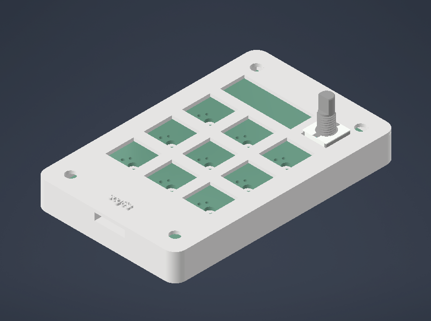
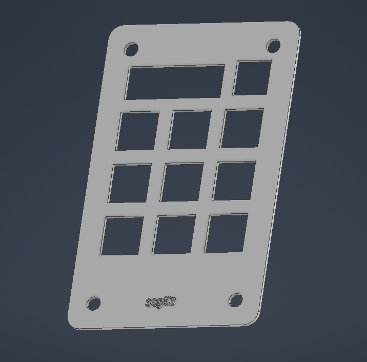
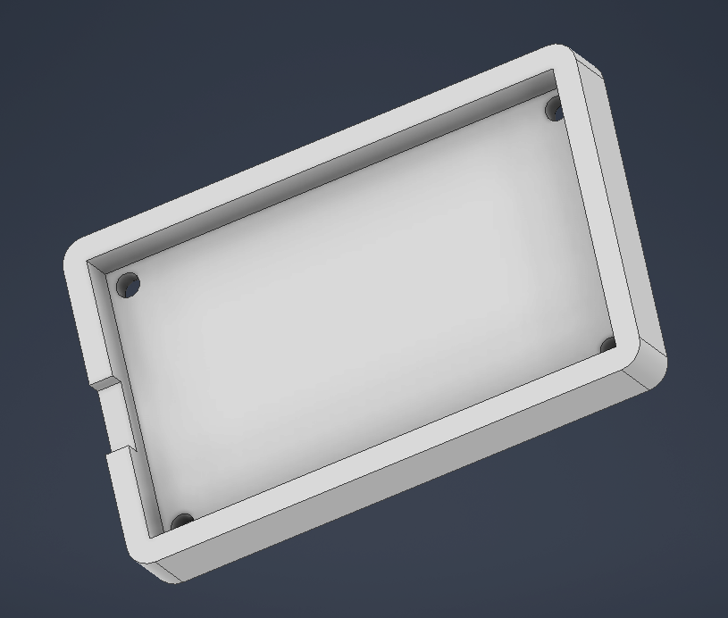
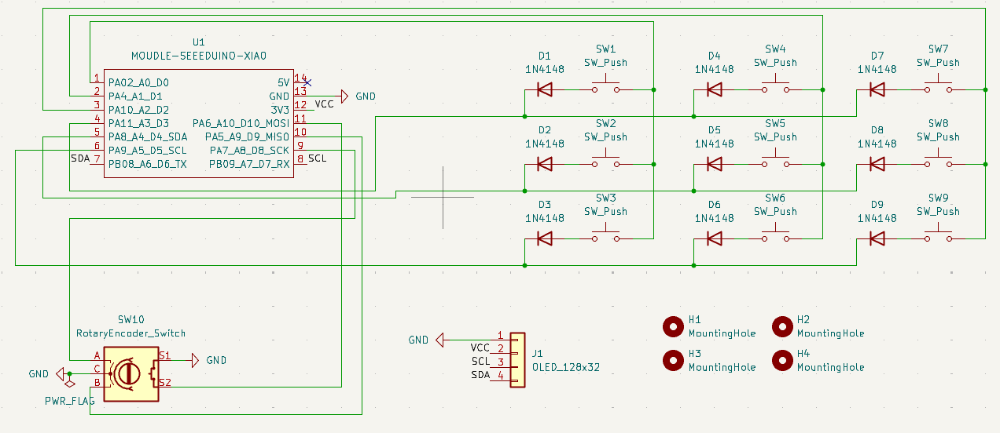
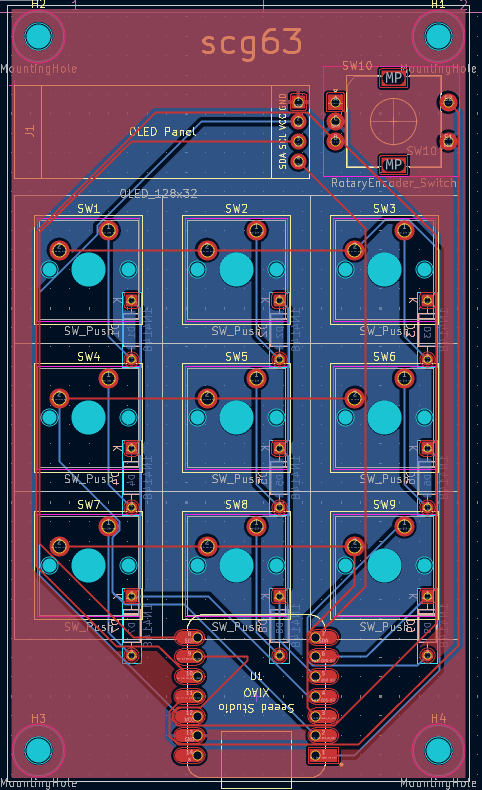
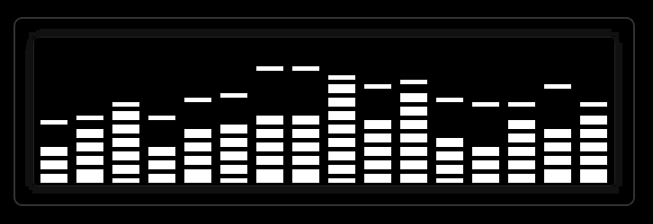

# MelodyPad

MelodyPad is a 9 key media macropad with a rotary encoder and an OLED display. It uses KMK firmware on CircuitPython and is built around the Seeed XIAO RP2040.

Built for the Hackpad YSWS through Hack Club Blueprint.

## Features:

* 3x3 key grid for media and productivity controls
* 128x32 OLED display showing an equaliser bars animation
* EC11 rotary encoder for volume control
* 3 layers: Media, DAW shortcuts, and System/Function keys
* Fully 3D printed case
* No LEDs — clean and simple build

## CAD Model:

The case is two pieces — a top plate and a bottom enclosure. Everything is held together with 4 M3x16mm screws and M3x5x4mm heatset inserts.

---

---

The top plate is 1.5mm thick at the switch cutouts so MX switches clip in securely. The encoder shaft and OLED display window are cut into the top section above the key grid.

Made in Autodesk Inventor.
---

---

---

## PCB:

Designed in KiCad. 2-layer board, 59.5mm x 100mm.

---

### Schematic

---

### PCB

---

* 3x3 switch matrix with COL2ROW diode configuration
* Diodes on the back layer, tucked between switch rows
* XIAO RP2040 mounted on the bottom center with USB-C accessible from the rear
* OLED header top-left, encoder top-right
* Ground pour on B.Cu

## Firmware Overview:

This macropad uses [KMK](https://github.com/KMKfw/kmk_firmware) firmware running on CircuitPython.

IMPORTANT NOTE: This macropad's firmware also includes the adafruit\_ssd1306 to interact with the OLED screen. This must be installed into the lib folder on the RP2040.

---

### OLED Animation (concept preview)

---

### Key Mapping

**Layer 0 — Media:**

|Prev|Play/Pause|Next|
|-|-|-|
|Stop|Mute|Vol Up|
|Layer 1|Layer 2|Vol Down|

**Layer 1 — DAW:**

|Undo|Redo|Save|
|-|-|-|
|Cut|Copy|Paste|
|\_\_|\_\_|\_\_|

**Layer 2 — System:**

|F13|F14|F15|
|-|-|-|
|F16|F17|F18|
|\_\_|\_\_|Reset|

**Encoder:** Volume up/down on Layer 0, zoom on Layer 1, brightness on Layer 2.

## BOM:

* 9x Cherry MX Switches
* 9x DSA Keycaps
* 9x 1N4148 DO-35 Diodes
* 1x EC11 Rotary Encoder
* 1x 0.91" 128x32 OLED Display (GND-VCC-SCL-SDA pin order)
* 1x Seeed XIAO RP2040
* 4x M3x16mm Screws
* 4x M3x5x4mm Heatset Inserts
* 1x 3D Printed Case (2 parts: top plate + bottom enclosure)

## Setup:

1. Flash CircuitPython from https://circuitpython.org/board/seeeduino\_xiao\_rp2040
2. Copy `main.py` to your `CIRCUITPY` drive
3. Copy `adafruit\_ssd1306.mpy` to the lib folder in your `CIRCUITPY` drive (accessible at https://github.com/adafruit/Adafruit\_CircuitPython\_SSD1306)
